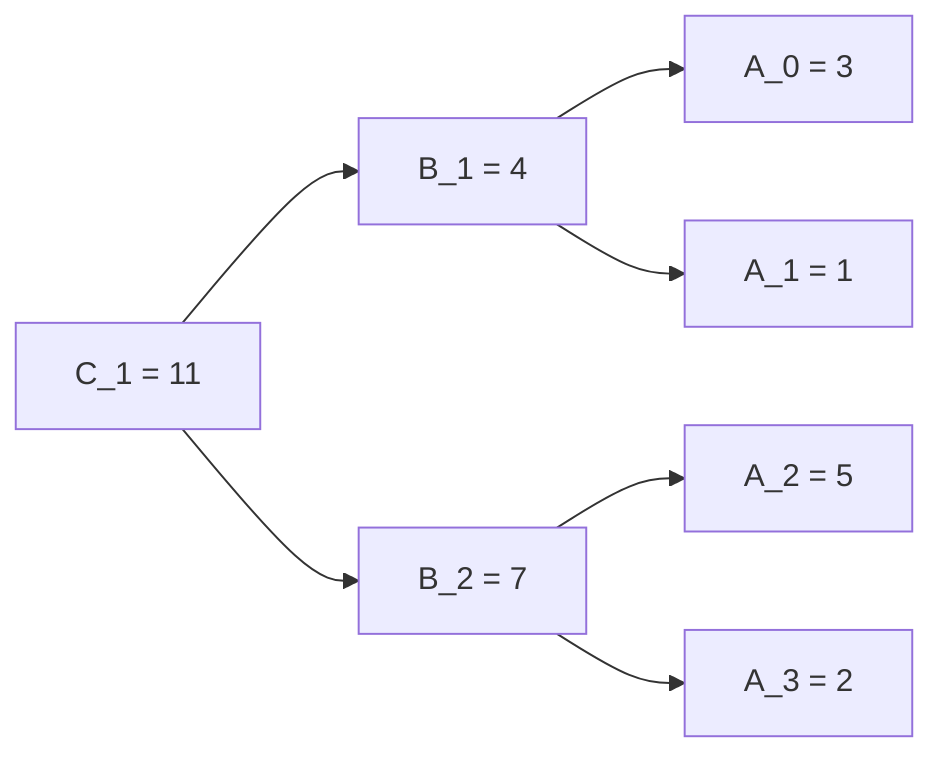

# 【南川算法笔记】高级数据结构：线段树


## 场景

线段树主要用于频繁对序列进行区间操作的场景。

例如，若有个序列`A = [3, 1, 5, 2, 4]`，其长度为`n=5`。

我们记`get(A, i)`与`get(A, i, j)`分别为查找`A`上`i`的值或区间`[i: j]`的和；

同时记`add(A, v, i)`与`add(A, v, i, j)`分别为给`A`上`i`的值加上`v`或区间`[i: j]`上分别加上`v`。

现在我们分析一下四种操作的时间复杂度，显然当序列以数组形式存储时，查询与修改某个点的值都只需要`O(1)`的时间，但是查询与修改某个区间的值都需要`O(n)`的时间，当区间查询与修改的频度`m`过大时，算法的复杂度为`O(n*m)`，这是不太能令人接受的。

而线段树、树状数组等高级数据结构的出现，就是为了能够**降低区间查询与修改的时间复杂度**，其代价就是，查询与修改某个点的时间复杂度上来了。但与其说是代价，不如说是平衡，它能够把`O(1)`与`O(n)`的朴素操作都平衡到`O(logn)`，这是非常了不起的进步。

在深入研究线段树之前，我们先来看看，如果使用较为平凡朴素的方法，其结果怎样。

## 二维数组法

作为弱渣的我，如果让我来设计一个支持任意区间查询的数据结构，我会想到什么？那一定是二维数组，记录每个不同区间长度下，对应的两个点之间的权值。例如，以上面的`A=[3, 1, 5, 2, 4]`为例，我会写出如下的下三角数组：

| 长度 \ 下标 | 0    | 1    | 2    | 3    | 4    |
| ----------- | ---- | ---- | ---- | ---- | ---- |
| 1           | 3    | 1    | 5    | 2    | 4    |
| 2           | 4    | 6    | 7    | 6    |      |
| 3           | 9    | 8    | 11   |      |      |
| 4           | 11   | 10   |      |      |      |
| 5           | 15   |      |      |      |      |


这样的一个二维数组，是很容易用两层`for`循环生成的，比如：

```c++
// 朴素的上三角矩阵，以记录一个序列任意区间的和
int A[5] = {3, 1, 5, 2, 4};
int A2[5][5];

// init first row
for(int j=0; j<5; j++) 
  A2[0][j] = A[j];

// update next four rows
for(int i=1; i<5; i++)
  for(int j=i; j<5; j++)
    A2[i][j] = A2[i-1][j-1] + A[j];
```


之后，我们就可以直接通过`A[3][2]`以获得从下标2出发，长度为3的区间内的和了，也就是我们的函数目标：`get(A, 2, 4)`。


但是，尽管，我们可以通过这张表，以`O(1)`的时间迅速获取任意一个值或一个区间的和，修改的代价却攀升了。

首先，修改一个元素的代价，将引发连锁反应。例如如果我们`add(A, 3, 2)`即把第三个元素加3，则所有涉及到第三个元素的值，我们都要修改一遍，具体的波及范围如下：


即整个平行四边形区域内的值，都要进行同步修改，可知，如此的代价已然达到了`O(n^2)`，这是完全不能接受的。

其次，区间修改呢？就更不用说了，至多能达到`O(n^3)`，如果不考虑一些优化的话。

所以，朴素的二维数组法，就算我们能接受它生成时一次性的`O(n^2)`，并能够获得单点、区间查询的`O(1)	`便利，我们也绝无可能接受它在单点修改与区间修改上的巨额代价！

## 线段树的基本设计

线段树本质上不是什么特别复杂的设计，其思想依旧是很朴素的。正如“区间查询与修改”这项需求的本身所要求的那样，线段树只是正好利用了数学上“区间可拆分”的概念将所有区间的信息以一种巧妙的方式组织了起来。

还是我们刚刚的二维数组法，我们的基本思想是不变的，我们确实需要”一张表”来记录我们的区间和信息，但以“减而治之”（每次步长为1）的方法实现的结果在某些方面（序列修改）的性能难以令人满意。

既然减而治之行不通，不妨试试**“分而治之”**的办法！

于是乎，原来每次一步步地将区间延长，记录延长后的区间和信息；现在，我们每次一倍倍地将区间合并，记录延长后的区间和信息，每个区间之间没有重复的孩子，所以，这就是一颗**“二叉树"**！

假设现在原序列只有$2^k$个结点（否则需要做一些调整处理），这样的话，可以生成一颗完全二叉树，如下：




现在，我们已经能够很方便地得到某个区间的和了，比如要获得0到2之间的区间和，只需要获得`B_1`和`A_2`的和就可以了，总之，可以以`O(logn)`的方式获得一个区间和，这是毋庸置疑的。（此处不展开查询区间和的细节，毕竟用二维数组也可以方便做到区间和的查询。）

但单点更新与区间更新呢？我们是否还能达到`O(logn)`的性能呢？

很显然，如果单点更新，`O(logn)`是分分钟就能达到，比如`add(A, 2, 0)`，即对第一个元素增加2，我们可以从叶子节点逐层更新到根节点，其链路上将一共更新3个结点，也就是$log_2{4} + 1 = 3$。


麻烦的是区间更新，我们如何能够达到`O(logn)`的区间更新呢？

答案是**“懒”**！

## 线段树的“懒更新”技术（场景：区间修改）

没错，就是“懒”，不但程序员喜欢懒，需要懒，数据结构也需要懒！

但理解懒更新的技术，我们需要回过头来思考一下，我们为什么走到了线段树的一步，理清这一点很关键。

我们的目标是寻找一种能在`O(logn)`时间内实现单点查询、单点修改、区间查询、区间修改的数据结构。

暴力法能够在`O(1)`时间内完成单点查询与单点修改，但区间查询和区间修改均需要`O(n)`；

二维数组法能够在`O(1)`时间内完成单点查询与区间查询，但单点修改与区间修改均需要`O(n)`甚至`O(n^2)`；

线段树使用分而治之的思想能够在`O(logn)`时间内完成单点查询、单点修改、区间查询，现在，只剩下最后关键一步：区间修改。

准确地说，目标是：给定任意一个区间修改指令，使得在`O(logn)`时间内修改完成，并且不影响接下来的查询与修改操作。

我们首先思考对线段树进行暴力修改，例如以`A = {3, 1, 5, 2}`为例，执行`add(A, 2, 1, 3)`操作，这将得到`A_new = {3, 3, 7, 4}`，那么相应的，线段树上需要怎样的执行与响应呢？

一种朴素的办法就是，从叶子结点逐层往上合并更新，我们先更新`A[1] += 2 -> 3`，再更新`A[2] += 2 -> 7`与`A[3] += 2 -> 4`；同时，继续往上更新，直到根节点。如下：


显然，最坏的情况下，需要更新所有的结点，时间复杂度是`O(2n)`，这依旧是不能接受的。

我们思考一下，是否有改进的空间呢？毕竟花这么大代价，设计这么一个数据结构，我们可不想我们的努力付诸东流了。

理解在线段树上高效执行区间修改的关键在于，意识到越底层的数据细节是越不重要的，因为我们查询某一个区间和的时候，是从上往下递归查找，所以我们只需要更新几个关键结点的值，这个区间修改操作，就等效果地完成了。

不妨还是以上面的`add(A, 2, 1, 3)`为例，由于在区间`[1, 3]`内`A[1]`是独立的，因此其必须更新，但是`A[2]`和`A[3]`共享一段子区间，它们同是`B_2`的孩子，秉承“擒贼先擒王”的思想，我们搞定它们的爸爸，这个区间就算完成了，即，我们执行`B[2] += 4`，然后无视它们的孩子（`A[2]`、`A[3]`）即可。

这样，我们达到的效果是什么呢？

如果我们从上往下执行任一一个区间查询的操作，或者我们每个修改后的子区间理解为稳固的水坝，会发现，除非要单独获取到`A[2]`或者`A[3]`的值，否则，它们的父亲`B_2`能做到滴水不漏。但凡要查询包含2和3的区间和，使用`B[2]`即可以。用罗老师的话说：

> **lazy-tag方法**“：当修改的是一个整块区间时，只对这个线段区间进行整体上的修改，其内部每个元素的内容先不做修改，只有当这部分线段的一致性被破坏时才把变化值传递给子区间。
>
> 那么，每次区间修改的复杂度是$O(log_2n)$，一共有Q次操作，总复杂度是$O(nlog_2n)$。做lazy操作的子区间，需要记录状态（tag）。（可以用一个数组实现）

尽管这听起来很兴奋，毕竟能做到只更新几个父结点（而非“枝繁叶茂的叶子结点”），这是性能相当高的（`O(logn)`），但是如果我们就是要单独获取到那个偷懒的`A[2]`怎么办呢？

那就让它获取吧！因为你只需要这一条路径的值，所以当你需要展开这个区间的详细信息时，你再去把父结点的`B[2] += 4`的操作传导到下方，即`A[2] += 2, A[3] += 2`，然后，over！这就是“懒更新”的关键所在！

所以，为了实现这样的“懒更新”操作，我们需要额外的信息去标记每个“懒更新”的结点，比如，我们可以额外使用一个数组，存储每个结点的懒更新信息，等到需要的时候，再将这个结点真实更新，并往下传导到下一个可以偷懒的结点，或者直到最后一个叶子结点。具体的区间更新示意图如下：


## 线段树的实现细节

要实现线段树，并不困难，只需要把握住二分的思想，但在细节上，确实有诸多需要考虑的地方。

### 链表 or 数组？

首先是选择链表亦或数组，由于线段树的二叉性质，因此使用递归 + 二叉链表的方式，是很容易实现的，但这两个东西组合在一起，性能不够强大（并且网上资源很多，不用从本篇文章了解线段树最基础的链表+递归初始化方法）。

由此，直接给出数组的实现方式。

### 线段树的初始化

线段树的数组的初始化，其核心思想就是把握住**完全二叉树中左孩子结点的下标正好等于父结点的两倍**，基于此，我们可以从后往前填充，构建一个完整的数组。但由于序列的个数可能不满$2^k$个，这样造成父子结点之间计算的复杂，所以可以考虑，事先将原序列填充成$2^k$个。

这里需要一点小技巧，我们可以使用边界测试法，快速写成较为准确的答案。我们知道不小于8的最小2次方幂是$2^3$，而不小于9的最小2次方幂是$2^4$，但由于$2 ^ 3 == 8$，因此，给我们的启示是先将$n$减去1，再求对数，然后再加1，就能求出$k$。因为$\log_2(8-1) + 1 =3$ 并且$ \log_2(9 - 1) + 1 =4$。

值得注意的是，在后续递归进行区间（或端点）更新时，往上更新父结点的操作与初始化是一致的，基于此，我们可以封装原子操作`push_up(int id)`，该函数用于更新第`id`个结点的值（基于它的两个孩子）。

例如，若是求最小值题型，可以写成

```c++
inline void push_up(int A[ ], int id) {
  A[id] = min(A[id << 1], A[id << 1 | 1];
}
```

其中,`A[id << 1]`是向左移位运算，等价于`id`乘以2；而`A[id << 1 | 1]`表示乘以2后再把第一位转化成1，由于乘以2后，最低一位必然为0，所以该式等价于`A[2 * i + 1]`，只不过位运算能够更快。


### 线段树的懒更新

线段树的懒更新实现起来，要稍微麻烦一些，但我们没有选择。

具体的话，就是首先使用一个至少原数据2倍长的数组（之所以不用4倍，因为所有的叶子结点（占2倍）可以无需考虑懒更新），尽管节省这点空间似乎没有太大意义，但作为勤俭持家的好男人，能省则省貌似是一种基本素养。

紧接着，当我们访问了从上往下再一次更新某段区间的时候，我们需要进行如下的四步考虑过程：

1. 该区间是否与目标区间一致，如果一致的话，就无需继续往下递归（并且也无需往下触发懒更新的变动）；
2. 如果不一致，则首先需要检查该区间是否有懒更新的标志，如果有的话，往下传递，完成后应i予以去除；
3. 开始往下递归，分区间包含与区间交错两种类型，这个之前已经有阐述，此处就不赘述了；
4. 递归完成后，表示这个结点已经完成了往下的更新操作，是时候返回了，这就是`push_up`操作，不过，也可以考虑另一种写法，那就是把`push_up`写进第一点中，也就是说只有遇到不需要再往下时，一次性地往上传递，这种写法从理论上性能更高一些，但在代码可读性上，判等、去标、深递归、回弹的四步曲将更胜一筹。

如果还是不理解的话，可以看一下罗老师这页的图解。


## 线段树实战

### 试题（Acwing 503. 借教室）

在大学期间，经常需要租借教室。

大到院系举办活动，小到学习小组自习讨论，都需要向学校申请借教室。

教室的大小功能不同，借教室人的身份不同，借教室的手续也不一样。 

面对海量租借教室的信息，我们自然希望编程解决这个问题。

我们需要处理接下来$n$天的借教室信息，其中第i天学校有riri个教室可供租借。

共有$m$份订单，每份订单用三个正整数描述，分别为$d_j, s_j, t_j$ ，表示某租借者需要从第$s_j$ 天到第$t_j$天租借教室（包括第$s_j$天和第$t_j$天），每天需要租借$d_j$个教室。 

我们假定，租借者对教室的大小、地点没有要求。

即对于每份订单，我们只需要每天提供$d_j$个教室，而它们具体是哪些教室，每天是否是相同的教室则不用考虑。 

借教室的原则是先到先得，也就是说我们要按照订单的先后顺序依次为每份订单分配教室。

如果在分配的过程中遇到一份订单无法完全满足，则需要停止教室的分配，通知当前申请人修改订单。

这里的无法满足指从第$s_j$天到$t_j$天中有至少一天剩余的教室数量不足$d_j$个。 

现在我们需要知道，是否会有订单无法完全满足。

如果有，需要通知哪一个申请人修改订单。

#### 输入格式

第一行包含两个正整数$n, m$，表示天数和订单的数量。 

第二行包含$n$个正整数，其中第$i$个数为$r_i$，表示第i天可用于租借的教室数量。 

接下来有$m$行，每行包含三个正整数$d_j, s_j, t_j$，表示租借的数量，租借开始、结束分别在第几天。 

每行相邻的两个数之间均用一个空格隔开。

天数与订单均用从1开始的整数编号。

#### 输出格式

如果所有订单均可满足，则输出只有一行，包含一个整数0。

否则（订单无法完全满足）输出两行，第一行输出一个负整数-1，第二行输出需要修改订单的申请人编号。

#### 数据范围

$1 \le n, m \le 10^6$

$0 \le r_i, d_j \le 10^9$

$1 \le s_j \le t_j \le n$

#### 输入样例

```
4 3 
2 5 4 3 
2 1 3 
3 2 4 
4 2 4
```

#### 输出样例

```
-1 
2
```


### 思路一、差分 + 二分查找

这题主要有两种思路，一种是由y总给出的基于差分、单调性的二分法。

具体他是这么描述的：


第三行理解起来比较困难，我对他的代码做了一些注释后，才逐渐理解y总的思路，具体如下。

```c++
#include <cstdio>
#include <cstring>
#include <iostream>
#include <algorithm>

using namespace std;

typedef long long LL;

const int N = 1000010;

int n, m;
int r[N], d[N], s[N], t[N];
LL b[N];

bool check(int k)                   // k是每次二分的中点订单编号
{
    for (int i = 1; i <= n; i ++ )  // b[i]记录目前的差分值
        b[i] = r[i];

    for (int i = 1; i <= k; i ++ )  // 差分更新（Important！）【把一半的订单都给加上】
        b[s[i]] -= d[i],            // 在申请单起始日，差分值减去申请量
        b[t[i] + 1] += d[i];        // 在申请单末尾日，差分值加上申请量

    LL res = 0;
    for (int i = 1; i <= n; i ++ )  // 差分累和过程中
        if(0 > res += b[i])         // 若为负则说明超过了最大容量
            return true;            // 返真表示二分继续往左半支进行
    return false;                   // 返否表示二分继续往右半支进行
}

int main()
{
    scanf("%d%d", &n, &m);
    for (int i = 1; i <= n; i ++ )  // r[i] 是每天的库存
        scanf("%d", &r[i]);
    for (int i = n; i; i -- )       // r[i] 变成差分，即每天比昨天多的库存量
        r[i] -= r[i - 1];

    for (int i = 1; i <= m; i ++ )  // d, s, t 分别是数量，起始，结尾
        scanf("%d%d%d", &d[i], &s[i], &t[i]);

    int l = 1, r = m;
    while (l < r)                   // 二分寻找第一份让库存爆掉的单子
    {
        int mid = l + r >> 1;
        check(mid) ? r = mid : l = mid + 1;
    }

    check(r) ? printf("-1\n%d", r) : puts("0");
    return 0;
}

// 作者：yxc
// 链接：https://www.acwing.com/solution/content/3045/
// 来源：AcWing
// 著作权归作者所有。商业转载请联系作者获得授权，非商业转载请注明出处。
```


不得不说，y总的思路十分之妙，想通之后实现起来也不复杂（就是二分要好好写，y总是算出边界后，再跑一次check，我后来尝试出如果二分不包含中点，最后可以不用多跑一次check，算是对y总方案的一点小改进，但雷同之处依旧很多，所以就不放我的二分版本了。）

### 思路二、线段树

线段树相较于二分，只是实现上面更复杂一些，但是思路上比二分的思路更容易理解，那就是维护每个区间的最小值，然后逐单更新，直到碰到最小值小于0，程序中途结束，否则程序正常结束。

如果这是一场考试，而我也受过相关的训练，我想，我的第一反应应该是直接上线段树了。

最后，给出我的线段树版本。

```c++
#include "cstdio"
#include "cmath"
#include "algorithm"

using namespace std;

const int MAX_N = 1e6 + 1;  // 教室的最大可能数量
int caps[4 * MAX_N];        // 线段树的数组实现需要开辟4倍空间
int lazy[MAX_N];            // 懒更新标记数组

int n, m;                   // n: 教室数量， m: 订单个数
int d, s, t;                // d: 租借数量， s: 租借开始日， t: 租借结束日

int H, N;                   // H: 树的高度，N: 树的结点数
int B;                      // B: 树的最后一层第一个结点编号，也是最后一层个数


inline void push_up(int i)
{
    caps[i] = min(caps[i << 1], caps[i<< 1 | 1]);
}


inline void push_down(int i)
{
    if(lazy[i]) {
        lazy[i << 1] += lazy[i],
        lazy[i << 1 | 1] += lazy[i];
        caps[i << 1] -= lazy[i];
        caps[i << 1 | 1] -= lazy[i];
        lazy[i] = 0;
    }
}


void build(int n)
{
    H = log2(n - 1) + 2;    // 树的高度，考虑8个结点，就是四层（1, 2, 4, 8）；9个结点就是5层
    N = 1 << H;             // 树的结点数，考虑4层，总结点数就是16（1+1+2+4+8），含虚结点
    B = N >> 1;             // 由于输入数据存在最后一层，所以记最后一层第一个结点下标为B(ase)
    
    // 将输入数据存入最后一层的起始部分
    for(int i=0; i<n; i++)   scanf("%d", &caps[B + i]);

    // 预填充最大
    for(int i=B+n; i<N; i++) caps[i] = 0x3f3f3f3f;

    // 最关键的一步，从后往前填充数组（根据两倍的父子关系）
    for(int i=B-1; i>0; i--) push_up(i);
}


bool updateStep(int d, int s, int t, int L, int R, int id)
{
    bool status = true;

    if(s == L && t == R) {
        if(L < R) lazy[id] += d; // 非叶结点，标记懒更新
        status &= (caps[id] -= d) >= 0;
    }
    else {
        push_down(id);

        int M = (L + R) >> 1;
        if(t <= M) 
            status &= updateStep(d, s,   t, L,   M, id << 1    );
        else if(s > M)
            status &= updateStep(d, s,   t, M+1, R, id << 1 | 1);
        else
            status &= updateStep(d, s,   M, L,   M, id << 1    ),
            status &= updateStep(d, M+1, t, M+1, R, id << 1 | 1);
        
        push_up(id);    
    }

    return status;
}

   
int update(int m)
{
    for(int i=1; i<=m; i++) {
        scanf("%d %d %d", &d, &s, &t);
        if(!updateStep(d, s, t, 1, B, 1))
            return i;
    }
    return 0;
}

int main()
{
    // freopen("/Users/mark/MarkLearningCPP/Acwing/503. 借教室/case1.txt", "r", stdin);
    scanf("%d %d", &n, &m);
    build(n);
    
    int i = update(m);
    i ? printf("-1\n%d", i) : printf("0");
    return 0;
}
```


最后必须指出，尽管线段树版本代码更长，但是其思想的绝妙，与熟练后书写的体验，将是绝无仅有的。

如果你现在还不会线段树，那就赶快学起来把，相信你会感激你的这份决定！


## 参考资料

- [1]罗勇军.算法竞赛入门到进阶[M].北京.清华大学出版社.2019:84-93
- 【数据结构2-2】线段树与树状数组 - 题单 - 洛谷 | 计算机科学教育新生态 - https://www.luogu.com.cn/training/206#problems
-  Acwing503. 借教室 - AcWing题库 - https://www.acwing.com/problem/content/505/


